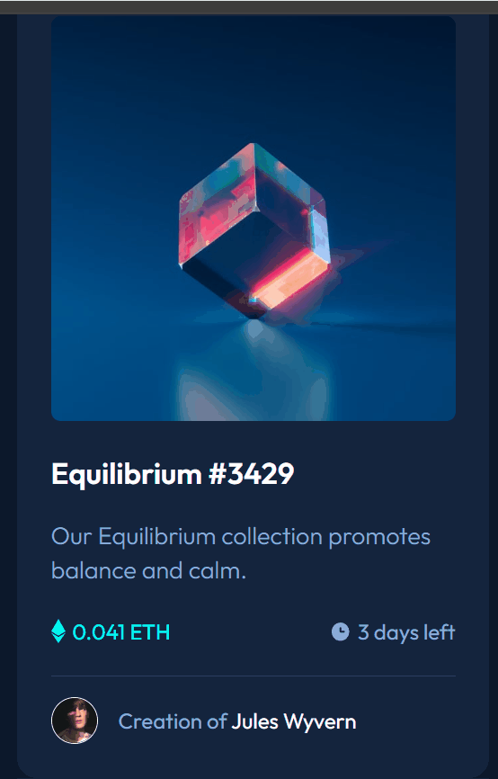

# Frontend Mentor - NFT preview card component solution

**Note: A versão em Pt-BR se encontra logo depois da versão em Inglês**

This is a solution to the [NFT preview card component challenge on Frontend Mentor](https://www.frontendmentor.io/challenges/nft-preview-card-component-SbdUL_w0U). Frontend Mentor challenges help you improve your coding skills by building realistic projects. 

## Table of contents

- [Overview](#overview)
  - [The challenge](#the-challenge)
  - [Screenshot](#screenshot)
  - [Links](#links)
- [My process](#my-process)
  - [Built with](#built-with)
  - [What I learned](#what-i-learned)
  - [Continued development](#continued-development)
  - [Useful resources](#useful-resources)
- [Author](#author)
- [Acknowledgments](#acknowledgments)

## Overview

### The challenge

Users should be able to:

- View the optimal layout depending on their device's screen size
- See hover states for interactive elements

### Screenshot



### Links

- Solution URL: [My GitHub repository](https://github.com/IsaiasLourenco/nft-card)
- Live Site URL: [My live site URL](https://isaiaslourenco.github.io/nft-card/)

## My process

### Built with

- Semantic HTML5 markup
- CSS custom properties
- Flexbox
- CSS Grid
- Mobile-first workflow
- [Styled Components](https://styled-components.com/) - For styles

### What I learned

HTML → Wrap the entire card along with the footer to have the same centralization and styling

CSS → 
Make all separate files, one for reset, reset.css, another for styling, style.css, and another for color variables, variables.css. Tks brothers from DevEmDobro!

```html 
<div>

  <body>
   
  </body> 

   <footer class="footer">
     Challenge by <a href="https://www.           frontendmentor.io?ref=challenge" target="_blank">Frontend Mentor</a>.
     Coded by <a href="https://github.com/IsaiasLourenco" target="_blank">Isaias Lourenço</a>.
   </footer>

</div>
```
```css
*{
    margin: 0;
    padding: 0;
    box-sizing: border-box;
}

a{
    text-decoration: none;
}
```

### Continued development

I've been working with programming for a long time, but I'm not used to Front-End, and especially *.css, the styles, FlexBox, FlexGrid, were very difficult for me. I hope to learn a lot more before I start learning React!
### Useful resources

## Author

- Portfólio - [Isaias Lourenço](https://isaiaslourenco.github.io/portfolio/)
- Frontend Mentor - [@IsaiasLourenco](https://www.frontendmentor.io/profile/IsaiasLourenco)
- GitHub - [@IsaiasLourenco](https://github.com/IsaiasLourenco)

## Acknowledgments

Many thanks to the DevEmDobro brothers, Beto and Cadú, and to everyone who is together with me on the Full Stack Developer path.

# Frontend Mentor - solução de componente de cartão de visualização NFT

Esta é uma solução para o [desafio do componente de cartão de visualização NFT no Frontend Mentor](https://www.frontendmentor.io/challenges/nft-preview-card-component-SbdUL_w0U). Os desafios do Frontend Mentor ajudam você a melhorar suas habilidades de codificação através da codificação de projetos realistas.

## Índice

- [Visão Geral](#Visão-Geral)
  - [O Desafio](#Desafio)
  - [Screenshot](#screenshot)
  - [Links](#links)
- [Meu processo](#Meu-Processo)
  - [Linguagens usadas](#Linguagens-usadas)
  - [O que aprendi](#O-que-aprendi)
  - [Desenvolvimento contínuo](#Desenvolvimento-contínuo)
- [Autor](#autor)
- [Agradecimentos](#agradecimentos)

## Visão Geral

### Desafio

Para completar o desafio, o programaador devem ser capaz de:

- Ver o layout ideal dependendo do tamanho da tela do dispositivo
- Ver os estados de foco para elementos interativos

### Screenshot


### Links

- Repositório GitHub: [Meu repósitório no GitHub](https://github.com/IsaiasLourenco/nft-card)
- Online URL: [URL Online da aplicação](https://isaiaslourenco.github.io/nft-card/)

## Meu Processo

### Linguagens Usadas

- Marcação HTML5 semântica
- Propriedades CSS personalizadas
- Flexbox
- CSS Grid
- Fluxo de trabalho voltado para dispositivos móveis
- [Componentes estilizados](https://styled-components.com/) - Para os estilos

### O que aprendi

HTML → Encapsular o card inteiro junto com o rodapé para ter a mesma centralização e estilo

CSS → Colocar todos os arquivos de CSS separados, um para reset, reset.css, outro para o estilo, style.css, e outro para variáveis ​​de cor, variáveis.css. Obrigada irmãos do DevEmDobro!

```html 
<div>

  <body>
   
  </body> 

   <footer class="footer">
     Challenge by <a href="https://www.           frontendmentor.io?ref=challenge" target="_blank">Frontend Mentor</a>.
     Coded by <a href="https://github.com/IsaiasLourenco" target="_blank">Isaias Lourenço</a>.
   </footer>

</div>
```
```css
*{
    margin: 0;
    padding: 0;
    box-sizing: border-box;
}

a{
    text-decoration: none;
}
```

### Desenvolvimento contínuo

Trabalho com programação há muito tempo, mas não estou acostumado com Front-End, e principalmente *.css, os estilos, FlexBox, FlexGrid, foram muito difíceis para mim. Espero aprender muito mais antes de começar a aprender React!

## Autor

- Portfólio - [Isaias Lourenço](https://isaiaslourenco.github.io/portfolio/)
- Frontend Mentor - [@IsaiasLourenco](https://www.frontendmentor.io/profile/IsaiasLourenco)
- GitHub - [@IsaiasLourenco](https://github.com/IsaiasLourenco)

## Agradecimentos

Agradeço muito aos irmãos do DevEmDobro, Beto e Cadú, e a todos os que estão comigo na trajetória rumo Full Stack Developer.